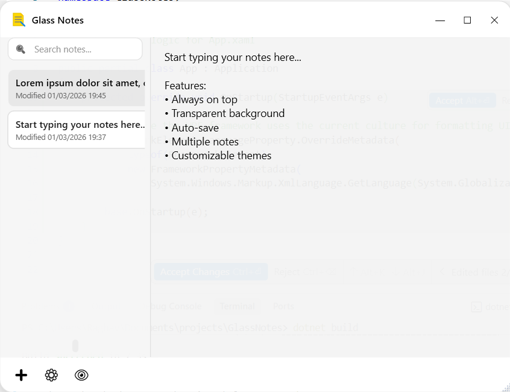
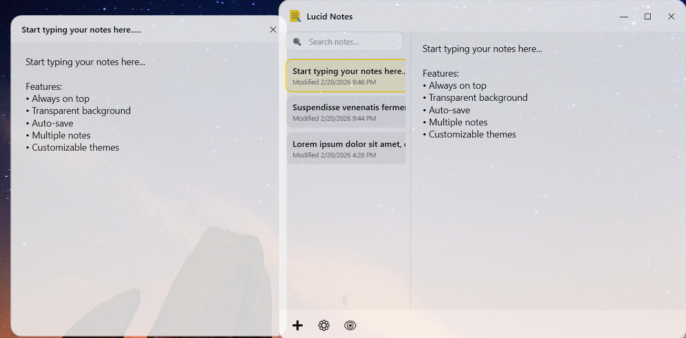
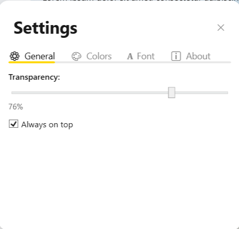

# Glass Notes - Transparent Notes App for Windows



Glass Notes is a modern, lightweight, **open-source** note-taking application for Windows 10/11 that features a beautiful **transparent overlay**. If you are looking for a transparent notes app, a minimalist sticky notes alternative, or an "always on top" desktop widget for productivity, Glass Notes is designed perfectly for your workflow!

### Download

<a href="https://apps.microsoft.com/store/detail/9N5SVJGDBHH2?cid=DevShareMCLPCS">
  
</a>

## Features

- **Always On Top** - Keep your notes visible while working in other applications
- **Customizable Appearance** - Choose between light and dark themes
- **Adjustable Transparency** - Set the perfect opacity level (30%-100%)
- **Hide Notes** - Quickly toggle the visibility of all your notes to declutter your workspace
- **Multiple Notes** - Create and manage multiple notes with quick switching
  
- **Auto-Save** - Your notes are automatically saved every 3 seconds
- **Clean, Modern Interface** - Built with Windows Fluent Design principles
- **Lightweight & Fast** - Minimal resource usage, instant startup
- **Resizable Windows** - Adjust size and position to fit your workflow

## Requirements

- Windows 10 (version 1809 or later) or Windows 11
- .NET 10.0 Runtime

## Building from Source

### Prerequisites

- .NET 10.0 SDK

### Build Instructions

1. Clone or download this repository
2. Open a terminal in the project directory
3. Run the following commands:

```powershell
cd GlassNotes
dotnet restore
dotnet build
```

### Run the Application

```powershell
dotnet run
```

Or build a release version:

```powershell
dotnet build --configuration Release
```

The executable will be in: `bin\Release\net10.0-windows\GlassNotes.exe`

## Usage

### Basic Controls

- **Drag the title bar** to move the window
- **Hide/Show Notes** by clicking the eye icon or pressing `Ctrl + Shift + Z`
- **Click the gear icon** to open settings
- **Click New** to create a new note
- **Click Delete** to delete the current note
- **Type directly** in the text area - changes auto-save

### Settings


- **Opacity**: Adjust window transparency (10%-100%)
- **Font Size**: Change text size (10-24pt)
- **Theme**: Switch between Light and Dark modes
- **Always on Top**: Toggle whether window stays above other windows

## Data Storage

Notes and settings are stored in:
```
%APPDATA%\GlassNotes\
├── Notes\           # Individual note files (.json)
└── settings.json    # Application settings
```

## Technology Stack

- **Framework**: WPF with .NET 10
- **MVVM**: CommunityToolkit.Mvvm
- **Data**: Newtonsoft.Json for persistence
- **Design**: Windows Fluent Design with Acrylic effects

## Project Structure

```
GlassNotes/
├── Models/              # Data models (Note, AppSettings)
├── ViewModels/          # MVVM view models
├── Services/            # Business logic (NoteService, SettingsService)
├── Helpers/             # Utility classes (WindowBlurHelper, ThemeHelper)
├── Resources/
│   ├── Themes/         # Light and Dark theme definitions
│   └── Styles/         # Control styles (buttons, textboxes, etc.)
├── Controls/           # Custom user controls
└── Assets/             # Icons and images
```

## License

This project is open-source and licensed under the [MIT License](LICENSE).

## Contributing

Contributions are welcome! Feel free to submit issues and pull requests.

